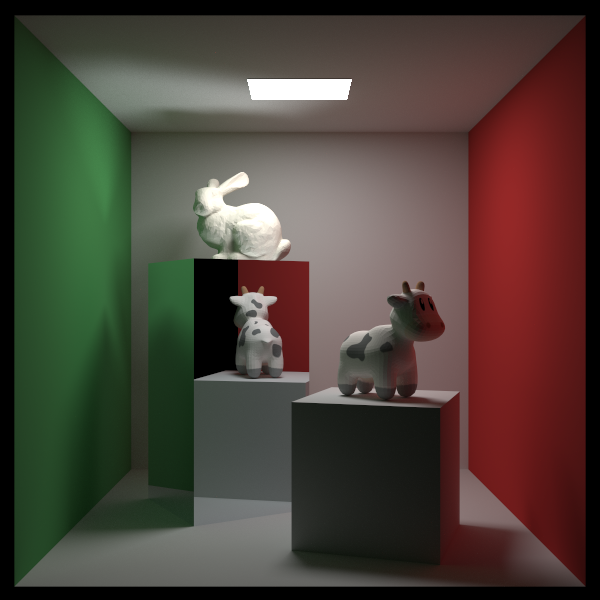
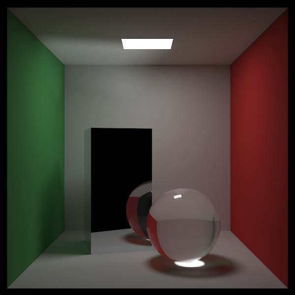

# Ray-Tracing

一个光线追踪渲染器，内容主要来自[Ray Tracing in One Weekend—The Book Series](https://raytracing.github.io/)


## 编译运行

本项目支持 makefile 和 cmake 两种方式

### makefile

本项目需要支持 `-std=c++20` 的编译器，由于项目后期出现编译时间过长的情况，所以编译过程被拆分为预编译和编译两部分

**预编译 && 编译**
```sh
# 预编译支持多线程编译 -j[线程数]
make pbuild -j12 && make build 
```

**运行**
```sh
make run [图片名]
```

推荐预编译后，编译运行并且记录运行时间（有些场景需要运行很久）
```sh
make build && time make run
```

### cmake

```sh
mkdir build && cd build
cmake .. -DCMAKE_BUILD_TYPE=Release
make
```

### 注意
1. 可执行文件在 `/build/RayTracing` 中，但是默认运行的路径为本项目的根目录。
2. 由于编译选项中启用了 `-march=native` 等与 `cpu` 强相关的选项，请在某平台运行前编译一遍

## 优化

### 多线程

由于整个项目是在 CPU 上运行的，所以在应对像素点很多的情况时，会运行的非常慢，所以采用有多线程，可以基本上使得运行时间 / 核心数。代码详见[这里](https://github.com/clumsy-sy/Ray-Tracing/blob/main/src/renderer/Renderer.hpp#L75), 由于 `shared_ptr` 会导致多线程运行时频繁的加锁，所以新版中改为 `unique_ptr`。

### SIMD!!!

并发编程非常适合这个项目，因为这个项目中大量运用了 `{double,double,double}` 的向量类型，对于两个向量之间的操作，可以通过 simd 一个指令完成，极大提升效率。代码详见[这里](https://github.com/clumsy-sy/Ray-Tracing/blob/main/src/vector/vec3dx4.h#L11C1-L11C1)

*注意： `-march=native` 等编译指令会自动进行一部分 simd 优化*

## 任务安排

### 硬件加速

- [x] 多线程 + SIMD
- [x] 性能更新，部分 shader_ptr 改用 unique_ptr，以解决在多线程运行中 shader_ptr 计数加锁的问题，提速效果显著。
- [x] 多线程调度升级
- [ ] 多线程池或者协程池，实现根据本地 CPU 核心数和程序运行情况，自动多线程。
- [ ] 更好的 SIMD 
- [ ] CRTP 实现静态多态

### 显示与效果

- [x] 程序进度可视化（进度条）
- [x] 支持三角形 + OBJ 文件
- [x] 光线旋转的完善
- [x] 由于原课程升级，项目大更新
- [X] 重要性采样
- [ ] 更多高效采样
- [ ] SAH 算法的实现，现在的 BVH 并不够智能与高效，需要更加优秀的划分策略。
- [ ] 与光子映射结合
- [ ] 曲面细分
- [ ] 场景信息由 Json 表示(进行中)

## 图片展示



**上图信息** 
> CPU： i9-13980HX  
> 图片大小：600 * 600  
> 单像素采样数：40000  
> 递归深度： 20  
> 运行时间：16:08.39  


